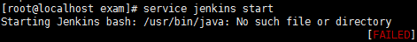
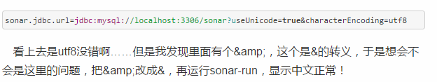
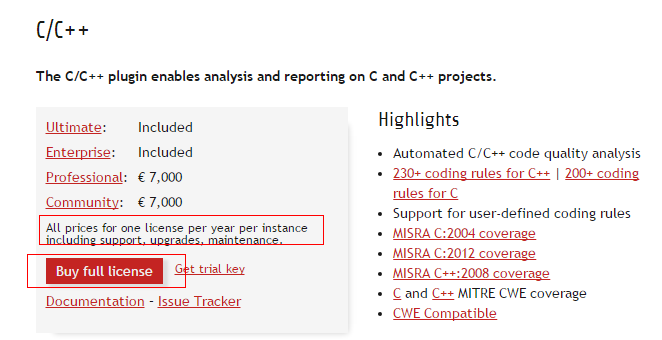
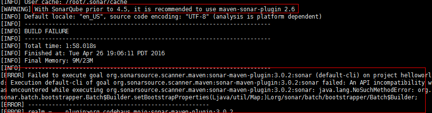
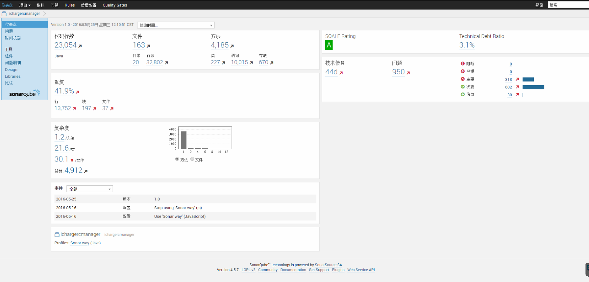
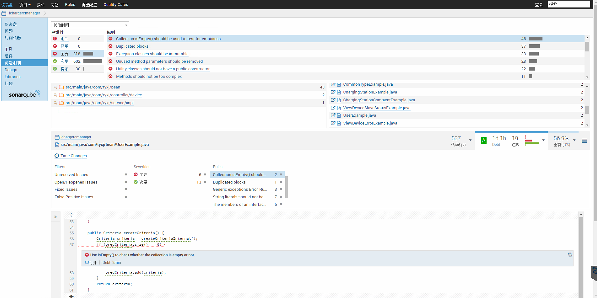

### 前言
Kurt Bittner曾说过，如果敏捷仅仅只是开始，那持续交付就是头条! 
*“If Agile Was the Opening Act, Continuous Delivery is the Headliner!”——Kurt Bittner*

五月上旬我的一个主要工作就是搭建持续交付平台。
打算以Jenkins为核心，每天定时从代码库中检出最新的代码进行编译、构建。构建结果通过自动发送的邮件通知到项目组，开发人员每天只需关心最新的集成结果是否正确即可。

再搭建SonarQube代码质量检测工具，单位时间定时扫描代码库最新代码，检测出代码中的存在的阻断错误、严重错误、主要错误、次要错误和相关提示信息。通过SonarQube能有效简洁统一代码风格，利于大家更好的相互理解和后期排查。

以下是搭建过程中用到的相关网站及碰到的坑，此处记录供以后查询所用。

### 相关网站
Sonar官方网站：[http://www.sonarqube.org/](http://www.sonarqube.org/)
Jenkins官方使用教程：[https://wiki.jenkins-ci.org/display/JENKINS/Use+Jenkins](https://wiki.jenkins-ci.org/display/JENKINS/Use+Jenkins)
Jenkins安装链接：[http://www.cnblogs.com/zhangqingsh/archive/2013/03/19/2968998.html](http://www.cnblogs.com/zhangqingsh/archive/2013/03/19/2968998.html)
Sonar安装链接：[http://flyingdutchman.iteye.com/blog/1905906](http://flyingdutchman.iteye.com/blog/1905906)
Sonar简介及安装地址：[http://www.ibm.com/developerworks/cn/opensource/os-sonarqube/](http://www.ibm.com/developerworks/cn/opensource/os-sonarqube/)
Jenkins使用集锦：[http://my.oschina.net/u/260244/blog/318755?fromerr=ZvUu6dmF](http://my.oschina.net/u/260244/blog/318755?fromerr=ZvUu6dmF)
Jenkins和Sonar整合地址1：[https://lasithapetthawadu.wordpress.com/2014/05/03/configure-jenkins-with-sonarqube-for-static-code-analysis-and-integration/](https://lasithapetthawadu.wordpress.com/2014/05/03/configure-jenkins-with-sonarqube-for-static-code-analysis-and-integration/)
Jenkins和Sonar整合地址2：[http://www.cnblogs.com/zhuhongbao/p/4197974.html](http://www.cnblogs.com/zhuhongbao/p/4197974.html)
搭建过程中涉及到的 JDK、Tomcat、Mysql、Redis、Maven等系列安装链接省略  0.0！


### 系列问题
**问题：通过命令直接安装Jenkins，连接被拒绝时**
**方案：**手动下载包，下载地址：[http://mirrors.jenkins-ci.org/war/](http://mirrors.jenkins-ci.org/war/)

**问题：Jenkins安装完成后启动报错**


**方案：**通过"vi /etc/init.d/jenkins"，把JDK的java路径加上即可
**注意：**Jenkins启动后自动部署Tomcat，Tomcat需先启动
<!--more-->

**问题：Sonar中文乱码问题**
**方案：**sonar-run配置有问题，里面的jdbc配置是：



**问题：Sonar某个版本安装成功后，启动却总只显示一个页面，并提示Sonar正在维护中**
**方案：**无需更换版本，仔细查看发现该提示页面可以直接点击进行相关插件的自动升级，重启后首页即可访问。

**问题：Sonar成功启动后，却总是马上自动关闭服务**
**方案：**很可能是没有启动mysql服务，启动即可。

**问题：Sonar成功运行后，如何显示中文?**
**方案：**在Settings/SYSTEM/Update Center/Available Plugins下安装汉化包，并重新启动Sonar。
**注意：**当某些插件总是下载失败时，可以直接搜索插件名手动下载，并在【系统管理--管理插件--高级--浏览-上传插件】中上传插件即可。

**问题：Jenkins集成Sonar后，Sonar无法扫描Java语言代码**
**方案：**在Sonar的Settings/SYSTEM/Update Center/Available目录下下载Java语言包，并重新启动Jenkins和Sonar。Jenkins会根据配置的扫描路径，定时扫描相关代码，并在Sonar中可视化。
**注意：**SonarQube集成Java插件官方地址：[http://docs.sonarqube.org/display/PLUG/Java+Plugin](http://docs.sonarqube.org/display/PLUG/Java+Plugin)

**问题：下载某语言包后，Sonar重启仍然无法扫描相关代码**
**原因：**如下载"C/C++/Objective-c"这个插件后，重新启动扫描C代码总是报错：
```bash
Caused by: org.sonar.api.utils.SonarException: No license for cpp
```
原以为是需要安装cpp插件，后来才发现重点是No license，意思就是需要付费购买许可证。
网上搜索免费许可证无果，然后点击"Get trial key", 结果立马收到官方邮件回复被拒，终放弃。


**问题：Jenkins集成Sonar后，Jenkins自动化脚本执行失败，并报如下错误**
**方案：**更换插件版本即可，下次安装需要注意。



**问题：Jenkins账户权限如何分配**
**方案：** 相关链接：[http://www.360doc.com/content/13/0802/14/7811581_304255550.shtml](http://www.360doc.com/content/13/0802/14/7811581_304255550.shtml)
**注意：** 如果用admin账户登录，在分配权限的时候，将admin权限全部置空，一旦退出，将无法使用 0.0！我当初的解决方法是修改远程配置文件，而如果配置文件一旦改乱，就只能重装了。

### 运行结果
**Sonar成功运行如图五图六所示，其中代码检测规则可以修改也可以自定义，对于图六显示出的具体错误，Sonar也可在页面直接分配给某个组员修改**




<br/>
#### 其它问题当时没有用有道云笔记详细记录，现在也无法记起，因此记录只有这么多了。此文仅供参考 ^.^
<br/>